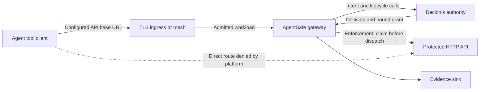

# Gateway deployment strategies

Put AgentSafe on the HTTP path that performs the action, then close the agent's direct path to
that API. A tool with a configurable base URL can use this boundary without a source-code change.
Pointing only the model client at a gateway does not intercept the agent's other tools.

This guide describes deployment patterns against the gateway implementation reviewed on
6 October 2026. The [setup guide](../gateway/deployment.md) supplies runtime configuration,
image verification, secrets, Helm values and hosted onboarding steps. Use an approved image
containing the reviewed changes; an example does not establish a deployed release's capabilities.

## Choose placement and integration separately

| Placement                                             | Gateway operator   | Authority                                          | Traffic and behavior                                                                                                                               |
| ----------------------------------------------------- | ------------------ | -------------------------------------------------- | -------------------------------------------------------------------------------------------------------------------------------------------------- |
| On-premises host or private cluster                   | Your platform team | Hosted Decionis                                    | Full API request stays on your relay path; intent, context and configured JSON fields reach the authority. Shadow or enforcement.                  |
| Private cloud or on-premises with a private authority | Your platform team | Separately provisioned compatible Decionis service | Relay and authority can stay within your approved network. Authority installation, connectivity and licensing are separate. Shadow or enforcement. |
| Decionis-managed cloud gateway                        | Decionis           | Tenant's Decionis workspace                        | Full request and upstream credentials traverse the managed relay to a public HTTPS API. **Shadow only** in the current hosted runtime.             |

Hosting the authority does not require hosting the gateway. On-premises placement does not imply
offline operation. Use the [trusted executor](../../deploy/README.md) when the agent must have no
upstream credential or when verified proposer/operator roles are required.

| Integration                 | Use it when                                                                 | What to configure                                                                                                   |
| --------------------------- | --------------------------------------------------------------------------- | ------------------------------------------------------------------------------------------------------------------- |
| Addressed reverse proxy     | The tool's HTTP base URL is configurable                                    | One `agentsafe proxy` instance per upstream; route the client through TLS ingress to it.                            |
| Kubernetes Service          | The protected API runs in a cluster                                         | Gateway Helm chart, caller egress policy, upstream ingress policy and a TLS mesh or ingress.                        |
| Service mesh                | Workloads already use mesh identity                                         | Traffic routing to the gateway, strict mTLS, gateway and upstream authorization policies, plus network confinement. |
| Transparent interceptor     | The tool cannot change its base URL                                         | `agentsafe intercept`, network redirect and a trusted interception CA for governed HTTPS.                           |
| Trusted executor or adapter | The API needs privileged credentials, URL signing or a non-HTTP integration | Registered handlers and authenticated proposals; a generic HTTP proxy does not provide these integrations.          |

## Request flow and responsibility



The platform authenticates the workload and restricts connectivity. Decionis supplies the policy
decision; AgentSafe binds the request, claims permission before dispatch and records the result.
The API still owns its business authorization, idempotency and transaction outcome. In enforcement,
BLOCK does not dispatch; ESCALATE holds until the configured approval journey produces a fresh
ALLOW and grant. A human signature alone is not permission to forward. In shadow, admitted
requests execute while decisions are observed.

## Host or Docker behind TLS ingress

Prepare `agentsafe.yaml`, the workspace key file and the evidence directory as described in the
[on-premises setup](../gateway/deployment.md#deploy-on-premises). Set `AGENTSAFE_IMAGE` to a verified
image reference with its digest. A Compose equivalent of that setup is:

```yaml
services:
  agentsafe-gateway:
    image: ${AGENTSAFE_IMAGE:?Set an approved image digest}
    command: [proxy]
    restart: unless-stopped
    user: "65532:65532"
    read_only: true
    cap_drop: [ALL]
    security_opt: ["no-new-privileges:true"]
    ports:
      - "127.0.0.1:8080:8080"
    environment:
      NODE_ENV: production
      AGENTSAFE_CONFIG: /etc/agentsafe/agentsafe.yaml
      DECIONIS_API_KEY_FILE: /var/run/agent-safe/secrets/decionis-api-key
      AGENTSAFE_BOUNDARY_ID: bank-payments
    volumes:
      - ./agentsafe.yaml:/etc/agentsafe/agentsafe.yaml:ro
      - ./secrets:/var/run/agent-safe/secrets:ro
      - ./evidence:/var/lib/agent-safe/evidence
```

The configuration names one `gateway.upstream`, the `authority` connection and the
`interception.routes` action mapping. Policy belongs in the authority. The gateway does not load
`policy.decision.json` through `POLICY_FILE_PATH`, and does not support `UPSTREAM_PROXY_MAP`,
`DECIONIS_ENV`, `LISTEN_PORT` or `TLS_ENFORCE`. Use
[documented configuration keys](../gateway/configuration.md). For another upstream, run another
gateway and map that tool to its own URL.

For a host-operated NGINX in front of the loopback listener, this server block admits only the
application paths. Supply the real certificates, and restrict client-CA issuance to the admitted
workloads or add an explicit workload authorization rule at ingress:

```nginx
server {
    listen 443 ssl;
    server_name agentsafe.bank.example;
    ssl_protocols TLSv1.2 TLSv1.3;
    ssl_certificate /etc/nginx/tls/server.crt;
    ssl_certificate_key /etc/nginx/tls/server.key;
    ssl_client_certificate /etc/nginx/tls/agent-runner-ca.crt;
    ssl_verify_client on;
    client_max_body_size 1m;

    location ~ ^/(payments|refunds)(/|$) {
        proxy_pass http://127.0.0.1:8080;
        proxy_http_version 1.1;
        proxy_set_header Connection "";
        proxy_set_header Host $host;
        proxy_set_header X-Forwarded-For $remote_addr;
        proxy_set_header X-Forwarded-Proto $scheme;
        proxy_set_header Forwarded "";
        proxy_set_header X-Agent-Identity "";
        proxy_next_upstream off;
    }

    location / {
        return 404;
    }
}
```

The proxy preserves the incoming path; the gateway appends it to the configured upstream base
path. Keep status and metrics on the operator network. If managed approvals are used, provide a
separately authenticated route to the resume endpoint with its resume token; this example does
not expose it. Review proxy deadlines for the complete decision/claim/finalization lifecycle.

NGINX's client-certificate check authenticates a transport peer. Setting
`interception.principalHeader: X-Agent-Identity` would only copy a header into
`context.claimed_principal`; AgentSafe does not verify that certificate or turn the header into
an authenticated proposer. Any deployment that propagates an identity header must overwrite
caller input at a trusted ingress and prevent direct listener access. Use `agentsafe serve` for
the runtime's verified principal boundary. Keep TLS verification enabled on the API hop; the
stock proxy does not itself present an upstream client certificate.

## Kubernetes NetworkPolicies

Use the [Helm setup](../gateway/deployment.md#run-in-the-banks-kubernetes-cluster), with the gateway
and API in `payments` and callers in a dedicated `agents` namespace. Add this caller-side policy
to the gateway policy and upstream policy shown there. It selects every pod in the agent
namespace, including pods whose workload labels change:

```yaml
apiVersion: networking.k8s.io/v1
kind: NetworkPolicy
metadata:
  name: agents-to-gateway-only
  namespace: agents
spec:
  podSelector: {}
  policyTypes: [Egress]
  egress:
    - to:
        - namespaceSelector:
            matchLabels:
              kubernetes.io/metadata.name: kube-system
          podSelector:
            matchLabels:
              k8s-app: kube-dns
      ports:
        - protocol: UDP
          port: 53
        - protocol: TCP
          port: 53
    - to:
        - namespaceSelector:
            matchLabels:
              kubernetes.io/metadata.name: payments
          podSelector:
            matchLabels:
              app.kubernetes.io/name: agentsafe
              app.kubernetes.io/instance: agentsafe
      ports:
        - protocol: TCP
          port: 8080
```

The namespace and pod selectors share one list item, so both must match. Substitute the actual
DNS topology, including NodeLocal DNS if used. TCP 8080 is the private listener under the TLS
mesh; if a separate ingress terminates TLS, select that ingress and its port instead and admit
only its pods to the gateway.

Use a NetworkPolicy-enforcing CNI. Policies are additive: another egress allow can reopen the
route. Inspect all policies on both sides, restrict namespace/workload administration and exclude
privileged or `hostNetwork` agents. Apply isolation before admitting workloads. The chart's
policy alone protects neither the agent's egress nor the API's ingress. See the
[Kubernetes policy semantics](https://kubernetes.io/docs/concepts/services-networking/network-policies/).

If the agent needs model inference, admit that specific destination separately and test that it
cannot become a generic proxy to the protected API. DNS resolution is necessary for routing; it
is not a destination or data-exfiltration policy by itself.

## Istio service mesh

Mesh authorization protects destination workloads; it does not redirect tool calls. Keep the
gateway base URL and the network policies. In this sidecar-mode example, both gateway and API
pods run with mesh sidecars, the caller uses service account `purchasing-agent` in `agents`, and
the gateway chart uses service account `agentsafe` in `payments`. Replace `cluster.local` if the
mesh uses a different trust domain.

```yaml
apiVersion: security.istio.io/v1
kind: PeerAuthentication
metadata:
  name: gateway-mtls
  namespace: payments
spec:
  selector:
    matchLabels:
      app.kubernetes.io/name: agentsafe
      app.kubernetes.io/instance: agentsafe
  mtls:
    mode: STRICT
---
apiVersion: security.istio.io/v1
kind: PeerAuthentication
metadata:
  name: payments-mtls
  namespace: payments
spec:
  selector:
    matchLabels:
      app: payments
  mtls:
    mode: STRICT
---
apiVersion: security.istio.io/v1
kind: AuthorizationPolicy
metadata:
  name: gateway-from-agent
  namespace: payments
spec:
  selector:
    matchLabels:
      app.kubernetes.io/name: agentsafe
      app.kubernetes.io/instance: agentsafe
  action: ALLOW
  rules:
    - from:
        - source:
            principals: ["cluster.local/ns/agents/sa/purchasing-agent"]
      to:
        - operation:
            ports: ["8080"]
            methods: [POST]
            paths: ["/payments", "/payments/*", "/refunds", "/refunds/*"]
---
apiVersion: security.istio.io/v1
kind: AuthorizationPolicy
metadata:
  name: payments-from-gateway
  namespace: payments
spec:
  selector:
    matchLabels:
      app: payments
  action: ALLOW
  rules:
    - from:
        - source:
            principals: ["cluster.local/ns/payments/sa/agentsafe"]
      to:
        - operation:
            ports: ["8080"]
```

These selectors belong in the destination workloads' namespace. Require strict mTLS at both
destinations and verify effective policy: another ALLOW can admit additional callers, and DENY
takes precedence. Add deliberately scoped rules for legitimate readers, operators or resume
callers when required. Mesh transport supplies mTLS on the internal HTTP hop; it does not add
native client-certificate support to AgentSafe's upstream client. Review control-plane, certificate
rotation and probe connectivity under the egress policy. These sidecar selectors are not an
ambient-waypoint recipe. See [Istio authorization](https://istio.io/latest/docs/reference/config/security/authorization-policy/).

## AWS VPC security groups

For EC2 or ECS with workload ENIs, give the agent, TLS gateway boundary and private upstream
separate security groups. Attach the groups to the actual interfaces or tasks. With a separate
load balancer, model its extra ingress-to-gateway hop explicitly. The required application paths
are:

| Group               | Direction | Allow                                                                  |
| ------------------- | --------- | ---------------------------------------------------------------------- |
| Agent               | Outbound  | TCP 443 to gateway TLS ingress group                                   |
| Gateway TLS ingress | Inbound   | TCP 443 from agent group                                               |
| Gateway             | Outbound  | TCP 443 to upstream group and the approved authority destination       |
| Private upstream    | Inbound   | TCP 443 from gateway group; other legitimate callers explicitly scoped |

Remove default broad egress from every group attached to the agent. Groups only allow traffic;
their rules combine, so omitting the agent group from one API rule does not override another
allow. Use supported private-path group references or narrow address ranges; broad `10.0.0.0/8`
is not a protected-service identity. Permit required custom DNS and authority connectivity.

Security groups cannot filter AmazonProvidedDNS/Route 53 Resolver traffic. Use DNS Firewall when
DNS filtering is required, and handle instance metadata through its own controls. EKS additionally
needs pod-aware enforcement; a shared node group does not establish separate agent/gateway
identities. See [AWS security-group semantics](https://docs.aws.amazon.com/vpc/latest/userguide/security-group-rules.html).

In Terraform, create the groups first and use separate ingress/egress rule resources for mutual
references. Putting each group's ID inside the other's inline definition creates a dependency
cycle. Review the final plan's effective rules and ENI attachments; creating unassociated groups
changes no workload's reachability.

## Azure VNet network security groups

Associate the agent, gateway and upstream NSGs with the intended subnets or NICs. Use exact
private addresses or application security groups, and replace the role names below with the
deployment's real addresses. For each direction, allow the required paths before a custom deny:

| NSG      | Direction | Priority | Destination/source and port                  | Action |
| -------- | --------- | -------- | -------------------------------------------- | ------ |
| Agent    | Outbound  | 100      | To gateway TLS ingress, TCP 443              | Allow  |
| Agent    | Outbound  | 110      | To approved resolver, TCP/UDP 53             | Allow  |
| Agent    | Outbound  | 400      | To any destination, any port/protocol        | Deny   |
| Gateway  | Inbound   | 100      | From admitted agent/ingress source, TLS port | Allow  |
| Gateway  | Inbound   | 400      | From any source, any port/protocol           | Deny   |
| Gateway  | Outbound  | 100      | To protected API, TCP 443                    | Allow  |
| Gateway  | Outbound  | 110      | To approved authority, TCP 443               | Allow  |
| Gateway  | Outbound  | 120      | To approved resolver, TCP/UDP 53             | Allow  |
| Gateway  | Outbound  | 400      | To any destination, any port/protocol        | Deny   |
| Upstream | Inbound   | 100      | From gateway source, API port                | Allow  |
| Upstream | Inbound   | 400      | From any source, any port/protocol           | Deny   |

Azure's default VNet allow means an Internet-only deny leaves internal bypass paths open. Lower
priority numbers run first. Review both subnet and NIC rules, required probe/management
exceptions and Virtual Network Manager security admin rules. Azure platform DNS and metadata
need their specific service-tag controls; a generic deny is not proof those paths are blocked.
Test new connections after changes because existing flows can remain active. Use Virtual Network
flow logs for new logging setups. See [Azure NSG behavior and platform exceptions](https://learn.microsoft.com/en-us/azure/virtual-network/network-security-groups-overview).

For AKS, also enforce the caller/upstream boundary at pod level. A subnet NSG shared by both
workloads does not distinguish their identities. In Terraform, include the subnet/NIC NSG
associations and the final deny rules; an unattached NSG or a lone allow rule does not confine an
agent. Keep the API's alternate public endpoint closed as well.

## Transparent interception

Use the [transparent interceptor](../gateway/transparent-interception.md) when base URLs cannot
be changed. The supplied [Docker](../../deploy/intercept/docker/compose.yaml) and
[Kubernetes](../../deploy/intercept/kubernetes) recipes redirect TCP 80/443 in the workload's
network namespace. Governed HTTPS requires the workload to trust an interception CA; mount its
private key only in the interceptor.

Choose governed hosts and the treatment of unlisted destinations explicitly. Observation mode
and the default unlisted passthrough are not enforcement. The agent must not use exempt UID
65532 or hold privileges to change redirect rules. Treat other ports, loopback and UDP/QUIC
separately. Certificate pinning and provider mTLS need another integration. This interceptor is
not a generic CONNECT proxy or a raw database protocol gateway.

## Managed cloud setup

For the Decionis-operated gateway, follow [hosted onboarding](../gateway/deployment.md#set-up-the-decionis-managed-cloud-gateway):

1. Agree the tenant workspace, public HTTPS upstream, allowed traffic, retention and operator access.
2. Serve the upstream ownership token at `/.well-known/agentsafe-upstream` and complete verification.
3. Receive the assigned `https://<id>.decionisedge.com` URL and tenant ingress key through a secret channel.
4. Change the tool base URL and provide `AgentSafe-Tenant-Key` from trusted configuration. Keep upstream authentication separate.
5. Exercise approved test traffic and confirm `agentsafe-mode: SHADOW` and `agentsafe-execution: PASSTHROUGH` on consequential calls.

The full request traverses that relay. Current hosting requires a public HTTPS upstream and
operator onboarding; it does not offer private-network relay, arbitrary streaming or hosted
enforcement. An organization that needs enforcement can operate the gateway in its own network
and connect it to the hosted authority instead. Workload egress and API ingress controls still
belong to the customer; any hosted egress allowlist must use addresses agreed with the operator.

## Verify the boundary before promotion

Run checks from the real agent network namespace and identity, against a synthetic or approved
test API. Keep a counter or receipt log at the API to establish whether an effect occurred.

| Check                                                 | Evidence required                                                                                       |
| ----------------------------------------------------- | ------------------------------------------------------------------------------------------------------- |
| Gateway ALLOW                                         | Gateway decision/claim evidence and exactly one test effect at the API                                  |
| Gateway BLOCK                                         | Gateway `NOT_FORWARDED`, expected refusal and zero API effects                                          |
| Gateway ESCALATE                                      | `202` / `HELD`, zero effects until a valid approval and fresh claim; resume reaches the holding replica |
| Authority unavailable                                 | Enforcement with fail closed refuses; zero API effects                                                  |
| Direct API call                                       | The deployed network or workload-identity control rejects the actual agent; zero effects                |
| Alternate hostname/IP, IPv6 or redirect               | No alternate path to the API outside the intended boundary                                              |
| Spoofed identity header or missing client certificate | Transport/identity policy refuses or keeps the header untrusted; it grants no extra permission          |
| Restart or uncertain provider response                | Reconcile from evidence and provider idempotency; do not blindly repeat the action                      |

A deployment-pipeline reachability probe can use a read-only canary endpoint on the same listener
and network boundary as the API. This diagnostic exits 1 when it observes HTTP reachability and
2 when the result is inconclusive; the platform-specific evidence check must establish a pass:

```bash
# Run inside the agent container; the image used for this check must contain curl.
# Set this to an approved canary URL with no side effect.
: "${UPSTREAM_CANARY_URL:?Set the approved upstream canary URL}"
probe_exit=0
probe_status=$(curl --proxy '' --noproxy '*' \
  --connect-timeout 3 --max-time 5 --silent --show-error \
  --request GET --output /dev/null --write-out '%{http_code}' \
  "$UPSTREAM_CANARY_URL") || probe_exit=$?
printf 'direct_probe curl_exit=%s http_status=%s\n' "$probe_exit" "$probe_status"
if [ "$probe_exit" -eq 0 ]; then
  printf 'Direct HTTP reachability observed; inspect the expected admission control.\n' >&2
  exit 1
fi
printf 'Inconclusive: correlate denial logs with a working gateway-path probe.\n' >&2
exit 2
```

Any HTTP response establishes reachability. A 401 or 403 is not proof of a network drop; if an
identity control is the intended boundary, correlate its refusal with that control's logs. Curl
`000` can mean a DNS error, certificate failure, dead service or a real network denial. Only pass
the deployment gate after the expected control's logs and a working gateway-path control probe
establish the cause. Do not count all timeouts as successful isolation. Record the tested image,
configuration and effective network-policy revisions with the evidence.

Start in shadow, then promote one tested workflow to enforcement with fail closed. Keep traffic
routed through the boundary during rollback: halt the workflow or restore its last approved
gateway configuration. Sending the caller directly to the API is a bypass. Review
[availability and held-request capacity](./high-availability.md) before scaling replicas.
