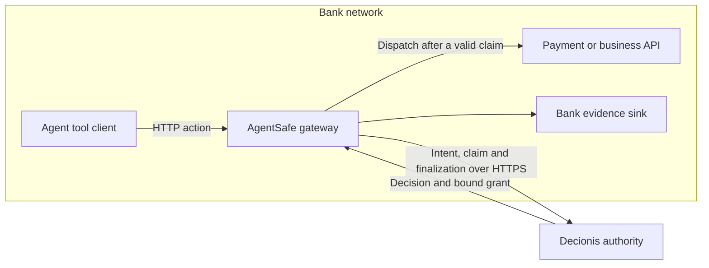
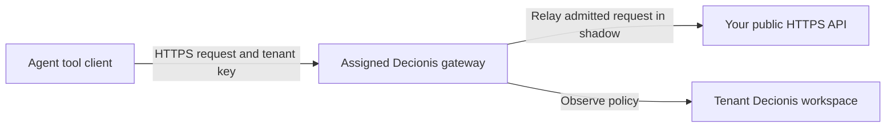

# Put AgentSafe in front of agent calls

Route the agent's tool or backend HTTP calls through AgentSafe before they reach the system that
performs the action. For example, a payment tool calls the gateway's `/payments` endpoint; the
gateway forwards to the bank's payment API after the required authority checks. Changing only
the agent's model endpoint does not put its separate payment, CRM or infrastructure tools behind
this boundary.

This guide covers the addressed gateway, deployment inside an institution and the Decionis-managed
gateway. It describes the implementation reviewed on 6 October 2026, including the accompanying
gateway hardening. Deploy an approved image containing the reviewed changes; the commands below
do not establish that a particular release or hosted tenant has them.

For Docker with TLS ingress, Kubernetes, Istio, AWS security groups and Azure NSGs, see
[deployment strategies and network isolation](../deployment/gateway-strategies.md). That guide
also describes how to validate direct-path denial without mistaking a DNS or TLS failure for
successful confinement.

## Choose where the gateway and authority run

| Deployment                                       | Action traffic                                        | Decision authority                                 | Available behavior                                                          |
| ------------------------------------------------ | ----------------------------------------------------- | -------------------------------------------------- | --------------------------------------------------------------------------- |
| Bank-operated gateway, hosted authority          | Agent to gateway to bank API, inside the bank         | Configured Decionis HTTPS endpoint                 | Shadow, then enforcement with fail closed                                   |
| Bank-operated gateway, bank-controlled authority | Agent to gateway to bank API, inside the bank         | Separately provisioned compatible Decionis service | Same gateway modes; authority deployment and licensing are separate         |
| Decionis-managed gateway                         | Agent to assigned cloud gateway to a public HTTPS API | Tenant's Decionis workspace                        | **Shadow only** in the current hosted runtime; operator onboarding required |

Using the hosted **authority** does not require using the hosted **gateway**. An on-premises
gateway can enforce decisions from `https://api.decionis.com` while the request is relayed to the
bank API locally. Method, path, query, context and embedded JSON fields still go to the authority.
The managed gateway instead receives the full request, including upstream credentials needed for
the relay, in the cloud. Review that distinction before choosing it for bank traffic.



The diagram shows enforcement. In shadow, admitted requests reach the API while policy is
observed; a would-be BLOCK does not stop the action.

## Put calls through the gateway

### Change the tool's base URL

Configure one gateway per protected upstream. Keep the original API as `gateway.upstream`, then
replace the base URL in the tool's HTTP client or SDK:

| Setting                     | Example                                        |
| --------------------------- | ---------------------------------------------- |
| Original tool base URL      | `https://payments.bank.example`                |
| Gateway upstream            | `https://payments.bank.example`                |
| Tool base URL after routing | `https://agentsafe.bank.example`               |
| A tool call                 | `POST https://agentsafe.bank.example/payments` |
| Request reaching the API    | `POST https://payments.bank.example/payments`  |

The application keeps the method, path, query, body, upstream authentication and a stable
idempotency key for the business operation. Configure the base URL in the trusted application
host, outside agent-generated prompts. The gateway removes hop-by-hop and reserved gateway
headers and adds its own evidence headers; it is not an arbitrary-host forward proxy.

An upstream URL can include a base path: with upstream `https://payments.bank.example/v1`, call
the gateway's `/payments` to reach `/v1/payments`. Do not also prepend `/v1` in the caller. Route
patterns match the path received by the gateway, before that upstream base path is added.

The gateway relays redirects without following them. Configure the tool to handle redirects
explicitly so an absolute upstream `Location` cannot move subsequent calls outside the gateway.
Test any authentication scheme that signs the host or URL: changing the SDK's base URL may change
its signature. Such integrations may need a registered executor adapter to sign at the execution
boundary.

`HTTP_PROXY` and `HTTPS_PROXY` do not configure `agentsafe proxy`: it is a reverse proxy with
one fixed upstream, and it does not implement a generic CONNECT proxy. For several APIs, give
each tool its corresponding gateway URL or use the transparent placement below.

### Make the route enforceable

Name the consequential routes so policy can distinguish operations, such as `payment.create`
and `refund.create`. Leave `interception.http: true` and `interception.unmatched: govern` for
full coverage of supported writes. The four consequential methods are POST, PUT, PATCH and
DELETE; GET, HEAD and OPTIONS pass without a decision and must be safe at the API. Unsupported
methods, common method-override headers and ambiguous consequential paths are refused by the
reviewed implementation. See [route matching](./routes.md).

Changing a base URL is routing, not containment. Restrict the API to calls from the gateway's
network or authenticated workload identity; deny direct calls from the agent. Also restrict
agent egress, alternate endpoints and any proxy or service-mesh path that could bypass that rule.
The standard gateway relays the caller's upstream credentials; use the
[trusted executor](../../deploy/README.md) when privileged credentials must be unavailable to
the proposing agent or when authenticated proposer/operator separation is required.

The gateway's listener is HTTP. Put the bank's TLS ingress, reverse proxy or mesh in front of it
and expose only the intended application routes. Restrict `/_agentsafe/status` and
`/_agentsafe/metrics` to operators; on a non-hosted gateway the status endpoint is not protected
by the metrics token. Keep TLS verification enabled on the upstream hop.

### When the tool cannot change its base URL

Use the [transparent interceptor](./transparent-interception.md) beside the agent workload.
The [Docker recipe](../../deploy/intercept/docker/compose.yaml) and
[Kubernetes component](../../deploy/intercept/kubernetes) redirect outbound TCP 80/443 into
`agentsafe intercept` in the workload's network namespace.

Start by observing destinations. To govern named hosts, configure `AGENTSAFE_INTERCEPT_GOVERN`,
the authority credentials and mode, and an interception CA trusted by the workload. Mount the CA
private key only in the interceptor. Governing HTTPS terminates TLS; certificate-pinned clients
and provider mTLS need a separately designed integration. The workload must not run as the
interceptor's exempt UID, 65532, or have privileges to change the redirect. Other ports, loopback,
UDP/QUIC and unlisted destinations need explicit network treatment; the default unlisted policy
is passthrough. Observation alone is not authorization enforcement.

## Deploy on premises

### Prepare the authority and configuration

Provision a Decionis workspace, its organization id and a service key using the bank's approved
process. Configure policy for the named actions before enabling enforcement. Mount the workspace
key as a file readable by the gateway user; `NODE_ENV=production` refuses the demo authority,
environment-value keys and stored developer login credentials.

Save this as `agentsafe.yaml`. Replace the reserved example organization id and bank API hostname:

```yaml
version: 1
gateway:
  listen: "0.0.0.0:8080"
  upstream: "https://payments.bank.example"
  environment: production
authority:
  endpoint: "https://api.decionis.com"
  tenantId: "00000000-0000-4000-8000-000000000000"
  mode: shadow
  failurePolicy: failClosed
  timeoutMs: 4000
interception:
  http: true
  unmatched: govern
  maxBodyBytes: 1048576
  maxEmbeddedBodyBytes: 65536
  routes:
    - path: /payments/**
      action: payment.create
      methods: [POST]
    - path: /refunds/**
      action: refund.create
      methods: [POST]
evidence:
  enabled: true
  journalDir: /var/lib/agent-safe/evidence
output:
  format: json
```

Small JSON bodies are sent as policy parameters up to `maxEmbeddedBodyBytes`. Set it to `0`
when policy must not receive the body, and redesign policy to use the remaining admitted facts.
This does not redact paths, query parameters or other context, and a digest cannot let policy
inspect an amount hidden from it. See [what the authority sees](./http-interception.md#what-the-authority-sees).

For a separately provisioned bank-controlled authority, change `authority.endpoint` to that
service's HTTPS endpoint and supply its workspace credential. Add the bank CA to the runtime's
trust store when needed, for example a mounted PEM under `/etc/agentsafe` with
`NODE_EXTRA_CA_CERTS` set before Node starts. Allow network access to that endpoint and its required
approval services. This repository does not install the Decionis service. `authority.endpoint:
local` is a demo, and the executor's `EXECUTOR_DECISION_AUTHORITY=edge` option is not a switch
for the generic gateway. On-premises placement alone does not make the flow offline.

### Run on a Linux host with Docker

Use a verified image digest, preferably mirrored in the bank's registry. In the deployment
directory, provision `secrets/decionis-api-key` from the secret manager, readable by UID/GID 65532
and not world-readable (for example owner 65532:65532 and mode `0440`). Create `evidence/` writable
by 65532 and make the non-secret configuration readable. Do not put key values in the image,
configuration or command line. Set `AGENTSAFE_IMAGE` to the approved image reference including
`@sha256:<digest>`.

```bash
docker run -d --name agentsafe --restart unless-stopped \
  --read-only --cap-drop ALL --security-opt no-new-privileges \
  --publish 127.0.0.1:8080:8080 \
  --mount "type=bind,source=$PWD/agentsafe.yaml,target=/etc/agentsafe/agentsafe.yaml,readonly" \
  --mount "type=bind,source=$PWD/secrets,target=/var/run/agent-safe/secrets,readonly" \
  --mount "type=bind,source=$PWD/evidence,target=/var/lib/agent-safe/evidence" \
  --env AGENTSAFE_CONFIG=/etc/agentsafe/agentsafe.yaml \
  --env DECIONIS_API_KEY_FILE=/var/run/agent-safe/secrets/decionis-api-key \
  --env AGENTSAFE_BOUNDARY_ID=bank-payments \
  "${AGENTSAFE_IMAGE:?Set the approved image digest}"

docker run --rm \
  --mount "type=bind,source=$PWD/agentsafe.yaml,target=/etc/agentsafe/agentsafe.yaml,readonly" \
  --mount "type=bind,source=$PWD/secrets,target=/var/run/agent-safe/secrets,readonly" \
  --env AGENTSAFE_CONFIG=/etc/agentsafe/agentsafe.yaml \
  --env DECIONIS_API_KEY_FILE=/var/run/agent-safe/secrets/decionis-api-key \
  "${AGENTSAFE_IMAGE:?Set the approved image digest}" config --json
curl --fail http://127.0.0.1:8080/_agentsafe/healthz
curl --fail http://127.0.0.1:8080/_agentsafe/readyz
docker logs agentsafe
```

Expose `https://agentsafe.bank.example` through the bank's TLS proxy to this loopback listener.
Permit gateway egress to DNS, the authority and the configured API. A private HTTP upstream
requires the explicit `gateway.upstreamInsecure: true` acknowledgement and a protected network
hop; prefer HTTPS. The stock gateway does not present a client certificate to an mTLS upstream.

The health and readiness probes check the process/listener, not end-to-end policy or API health.
After changing `authority.mode` to `enforcement`, recreate the container using the same mounted
configuration and image. The configuration file is not a live policy reload mechanism.
See [Docker installation](../install/docker.md) and [Linux/systemd installation](../install/linux.md)
for distribution and service management details.

### Run in the bank's Kubernetes cluster

Use the gateway Helm chart in the protected API's namespace. The separate `deploy/` executor kit
is for `agentsafe serve`, not this proxy. Provision the namespace and a Secret named `decionis`
whose `api-key` entry contains the workspace key, through the bank's secret-management process.

Save this as `gateway-values.yaml`, replacing the organization id and verified image digest.
The example assumes the `payments` Service uses port 8080 and its pods have `app: payments`:

```yaml
decionis:
  endpoint: https://api.decionis.com
  tenantId: "00000000-0000-4000-8000-000000000000"
  apiKeySecretRef:
    name: decionis
    key: api-key
image:
  digest: "sha256:REPLACE_WITH_VERIFIED_IMAGE_DIGEST"
gateway:
  mode: shadow
  failurePolicy: FailClosed
  unmatched: govern
  routes:
    - path: /payments/**
      action: payment.create
      methods: [POST]
    - path: /refunds/**
      action: refund.create
      methods: [POST]
upstream:
  service: payments
  port: 8080
networkPolicy:
  ingressFrom:
    - namespaceSelector:
        matchLabels:
          kubernetes.io/metadata.name: agents
      podSelector:
        matchLabels:
          app: purchasing-agent
  upstreamPodSelector:
    matchLabels:
      app: payments
```

From an approved checkout containing the chart:

```bash
helm lint ./charts/agentsafe --values gateway-values.yaml
helm template agentsafe ./charts/agentsafe --namespace payments \
  --values gateway-values.yaml > rendered-gateway.yaml
helm upgrade --install agentsafe ./charts/agentsafe --namespace payments \
  --values gateway-values.yaml
kubectl -n payments rollout status deployment/agentsafe
```

Point the in-cluster tool client at `http://agentsafe.payments.svc:8080` within the protected
cluster hop, or the bank's TLS/mesh endpoint for it. The chart's policy protects the gateway;
add a policy on the **upstream** to close the direct route. For the labels above:

```yaml
apiVersion: networking.k8s.io/v1
kind: NetworkPolicy
metadata:
  name: payments-from-agentsafe
  namespace: payments
spec:
  podSelector:
    matchLabels:
      app: payments
  policyTypes: [Ingress]
  ingress:
    - from:
        - podSelector:
            matchLabels:
              app.kubernetes.io/name: agentsafe
              app.kubernetes.io/instance: agentsafe
      ports:
        - protocol: TCP
          port: 8080
```

Save as `upstream-policy.yaml`, review against existing ingress policies, then apply with
`kubectl apply -f upstream-policy.yaml`. NetworkPolicies are additive: another allow policy can
still admit the agent. The CNI must enforce them. Test direct API access from the agent's actual
pod/identity and confirm refusal while the gateway path succeeds. Adapt the selectors and any
legitimate non-agent callers to the bank's topology.

Set `networkPolicy.authorityCidrs` to the actual authority ranges or use the cluster's equivalent
FQDN egress control. An empty list allows broad public TCP 443 egress, not just Decionis. A
private authority needs its private range admitted; if it uses another TLS port, adapt the
network policy, whose authority rule is port 443. Add the bank's agent egress policy as well.

The chart supplies two replicas and ClientIP affinity. Holds and their resume tokens belong to
one replica; an ingress proxy or a different resuming caller may defeat that affinity. Design
routing for the full approval journey and test restart loss. Retain ordered evidence separately
per replica and size memory for held bodies, rather than assuming the default 512 MiB limit covers
1,000 simultaneous 1 MiB holds. See [availability and capacity](../deployment/high-availability.md).

To promote the tested gateway, change `gateway.mode: enforcement` in the Helm values and run the
same `helm upgrade --install` command. Keep `gateway.failurePolicy: FailClosed`. These are Helm
keys; the equivalent runtime YAML uses `authority.mode` and `authority.failurePolicy`.

## Set up the Decionis-managed cloud gateway



The hosted runtime refuses enforcement mode. Treat this as an evaluation path with real
upstream effects, not a production authorization gate. Self-host a gateway with the hosted
authority for enforcement today. Provisioning a private dedicated service or a new managed
capability requires an explicitly agreed deployment; this guide does not assume it exists.

1. **Arrange operator onboarding.** Supply the API origin/base path, workspace organization and
   intended evaluation traffic through the existing Decionis onboarding process. Obtain the
   assigned `https://<tenant-id>.decionisedge.com` URL, a gateway tenant key, an origin-proof token,
   the operator's egress details, limits and the agreed evidence/report access. Confirm region
   and retention. The repository describes operator onboarding, not a self-serve signup API.
2. **Check API compatibility.** The origin must be public HTTPS with valid TLS and reachable from
   the fleet; private, loopback and shared addresses are refused. The stock relay cannot present
   a provider client certificate. It buffers requests/responses, has no streaming or WebSocket
   upgrade, sandboxes response content and strips cookie domains. Use it for compatible backend
   API calls. Current defaults include a 1 MiB governed request, 16 MiB response, 10-second upstream
   timeout and 50 requests/second with burst 100 per process; confirm tenant-specific limits.
3. **Prove control of the API origin.** Serve the issued token as UTF-8 text at
   `https://<api-host>/.well-known/agentsafe-upstream`, returning 200 directly without credentials
   or redirects, and leave it there. The alternative TXT record is
   `_agentsafe-challenge.<api-host>`; it also requires an HTTPS response from the origin's proof
   path with verified TLS. DNS alone is insufficient. With proof required, an unverified origin
   receives `503 UPSTREAM_UNVERIFIED`; wait for operator confirmation before sending business
   traffic. See [proof checks and renewal](./configuration.md#the-upstreams-proof).
4. **Change the tool's base URL and add the tenant header.** Send the same relative API path to
   the assigned host with `AgentSafe-Tenant-Key: <issued-key>`, alongside the API's own
   authentication. The tenant key admits traffic to the gateway and is stripped before relay.
   It is different from both the upstream credential and the Decionis workspace service key;
   never send the workspace key as an agent header or put any key in a URL. Inject the tenant
   key from the application host's secret store, outside model-visible prompts.
5. **Verify using an approved test operation.** A POST observed in shadow should return the
   upstream response with `agentsafe-mode: SHADOW` and `agentsafe-execution: PASSTHROUGH`.
   Verify the matching observation through the operator's report access. GET/HEAD/OPTIONS are
   unevaluated and have only the passthrough marker. Hosted status/metrics require the operator
   credential, not the tenant key. A would-be BLOCK still reaches the API in shadow.

For a command-line check, provision a private header file from the secret store, containing the
`AgentSafe-Tenant-Key` and the API's own `Authorization` header. The following example reads that
file so key values do not appear in the command's arguments. Use a test API/account: it sends a
real request.

```bash
curl --include --request POST \
  "${AGENTSAFE_BASE_URL:?Set your assigned HTTPS gateway URL}/payments" \
  --header @./secrets/hosted-request-headers \
  --header 'Content-Type: application/json' \
  --header 'Idempotency-Key: evaluation-payment-001' \
  --data '{"amount_minor":500,"currency":"EUR"}'
```

The current fleet registry does not expose tenant route configuration: POST/PUT/PATCH/DELETE use
`http.post`, `http.put`, `http.patch` and `http.delete`. Request named business actions through
an agreed integration or use the bank-operated gateway. Keep the origin proof served; losing
it can end forwarding after the configured proof-grace behavior. A returned `fallback` URL is
diagnostic information, not permission for an agent to bypass a required boundary automatically.

## Verify before enabling enforcement

Use a controlled test API and policy, and count effects at that API as well as reading responses:

| Test                                                        | Expected evidence                                                                     |
| ----------------------------------------------------------- | ------------------------------------------------------------------------------------- |
| ALLOW in enforcement                                        | One valid claim before one upstream effect; decision/intent/dossier bindings recorded |
| BLOCK                                                       | 403 and `NOT_FORWARDED`; zero upstream effects                                        |
| ESCALATE                                                    | 202 and `HELD`; zero effects until required approval and a fresh ALLOW                |
| Authority unavailable with fail closed                      | 503 `AUTHORITY_UNAVAILABLE`; zero effects                                             |
| Direct call from the agent to the protected API             | Denied by the actual network/provider boundary                                        |
| Unsupported method, method override or ambiguous write path | Admission refusal; zero effects                                                       |
| Timeout after dispatch                                      | `INDETERMINATE`; reconcile before retrying the business operation                     |
| Hosted key missing/wrong or origin unverified               | 401 or 503 with `NOT_FORWARDED`                                                       |

Configure managed Presence and an approver before expecting the generic gateway to resume a
hold. Follow the returned `resume` endpoint using the `AgentSafe-Resume-Token`; retain it in the
application's protected state. A 202 is not a successful payment. A stable idempotency key must
also be enforced by the upstream: a single-use grant is not a universal duplicate-payment ledger.
Do not blindly retry writes on 502 or timeout. See [response and resume semantics](./http-interception.md#holds-and-resume).

Measure the whole decision, grant-claim, upstream and finalization lifecycle. The authority
timeout bounds an individual call, not the complete action; human approval adds a separate wait.
Readiness alone does not prove the authority is available, the policy is right or bypass is denied.

For the joint Koard card flow, use `agentsafe serve` and the
[card executor contracts](../../packages/agentsafe/README.md#the-cards-family), with separate proposer and
issuer/operator principals. Koard verification happens before card submission; the issuer hook
matches and claims a held grant, then the issuer makes and reports the final card decision.
Redirecting arbitrary card traffic through the generic proxy does not install that processor
integration. See [the banking briefs](../banking/README.md).
