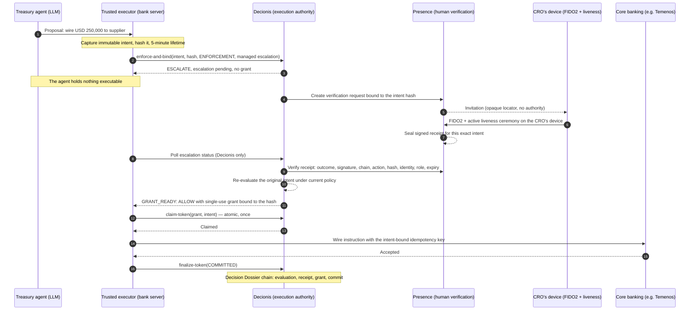

# A remote CRO authorizes a high-risk action

This walkthrough is for a bank audience: risk, operations, core-banking integration partners,
investors, and counsel. It shows one high-risk action from proposal to settlement and makes one point
throughout: **the agent that initiates the action cannot execute anything until an exact grant
exists, and only the authority can create that grant after a verified person approves.**

## The situation

A treasury agent working inside the bank's operations stack proposes a same-day USD 250,000 wire to
a supplier. Policy lets the agent act alone below USD 10,000, requires a verified human above it, and
blocks anything above USD 500,000. The Chief Risk Officer is travelling and has only their phone.

## The sequence

## What each party holds

| Party            | Holds                                                         | Cannot do                                                               |
| ---------------- | ------------------------------------------------------------- | ----------------------------------------------------------------------- |
| Treasury agent   | A proposal: action, target, parameters                        | Reach core banking, hold a credential, attach evidence, mint a grant    |
| Trusted executor | Decionis credential, core-banking credential, sealed handlers | Execute without a claimed grant; alter the intent after capture         |
| Decionis         | Policy, evaluation, grant issuance, dossier chain             | Approve on the agent's word; issue a grant for an unverified escalation |
| Presence         | Identity, device binding, ceremony, signed receipts           | Authorize execution; a receipt is evidence, not a grant                 |
| CRO              | Their enrolled device and their role                          | Approve a different intent than the one displayed; approve after expiry |
| Core banking     | The account and the settlement rail                           | Be reached except through the executor's handler with a claimed grant   |

## What the agent can do at each step

| Step                   | Agent's position                                                                  |
| ---------------------- | --------------------------------------------------------------------------------- |
| Before evaluation      | Proposes. Injected fields such as `authorized: true` are rejected at capture.     |
| After `ESCALATE`       | Waits on the executor. It has no grant, no invitation, no Presence access.        |
| During the ceremony    | Nothing. Delivery carries an opaque locator; possession is not approval.          |
| After the receipt      | Still nothing. The authority re-evaluates and only then may issue a grant.        |
| After `GRANT_READY`    | Nothing it can use: the grant is claimed by the executor, once, for this hash.    |
| After a changed amount | The changed intent has a new hash; the old grant fails `INTENT_BINDING_MISMATCH`. |
| After five minutes     | The intent expires; a late approval is discarded and recapture is required.       |

## Why this matters to a bank

- **Four-eyes without a shared screen.** The second pair of eyes is a verified person on their own
  device, bound to the exact instruction, not a button on the same console the agent uses.
- **Evidence that survives the incident review.** Every decision, receipt, grant, and commit is in
  a signed Decision Dossier chain that an offline verifier can check.
- **No standing credentials in the agent.** Core-banking access lives only behind the executor's
  handler and is exercised only against a claimed grant.
- **Fail closed everywhere.** Authority outage, malformed responses, expired grants, replayed
  grants, swapped receipts, and post-approval edits all stop execution with a stable reason code.

## Questions counsel and investors ask

| Question                                                 | Answer, with where it is enforced                                                                                      |
| -------------------------------------------------------- | ---------------------------------------------------------------------------------------------------------------------- |
| Could the agent claim the CRO approved?                  | No. Evidence is attached by the executor or resolved by Decionis, and verified against Presence. Attack 4 in the demo. |
| Could an approval for one wire be reused for another?    | No. The receipt binds to one intent hash. Attack 5.                                                                    |
| Could the amount change after approval?                  | No. The intent is frozen and hashed; the grant binds to the hash. Attack 6.                                            |
| Could a grant be used twice, or raced?                   | No. Claims are atomic and single-use. Attack 7.                                                                        |
| Could a person be tricked into approving something else? | Presence shows action, target, and hash before authenticating; Decionis checks the same hash. Residual human judgment. |
| Does the bank need to trust Decionis's word?             | No. Dossiers and receipts are signed and independently verifiable; the executor claims grants itself.                  |
| What if Decionis or Presence is down?                    | Nothing executes. Availability is traded for the guarantee that nothing runs unauthorized.                             |

The same sequence runs offline in the [golden adversarial demo](../examples/golden-adversarial-demo)
and against the live services in the [managed approval example](../examples/presence-managed-approval).
The semantics of the receipt are defined in [Presence Evidence semantics](./presence-evidence.md).
